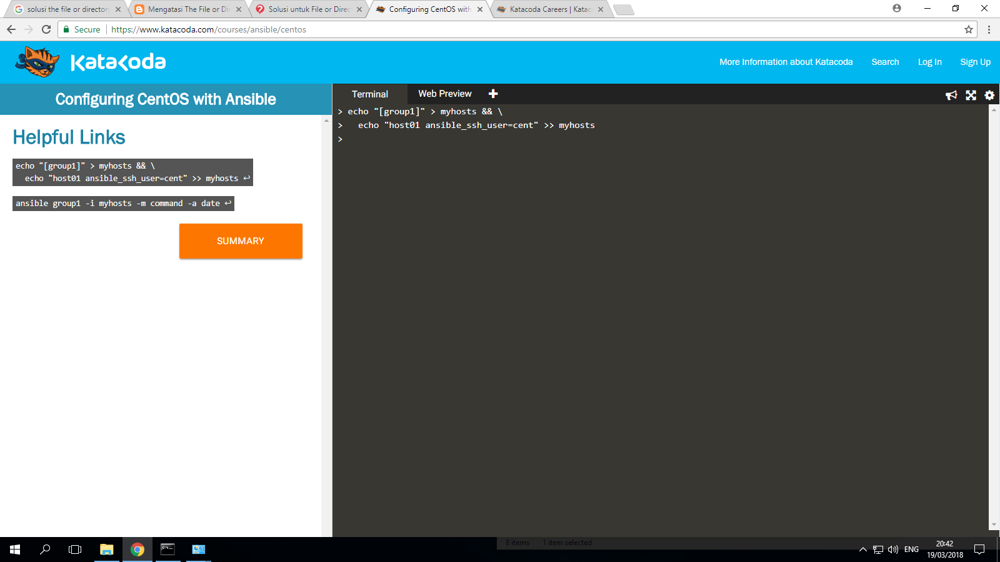
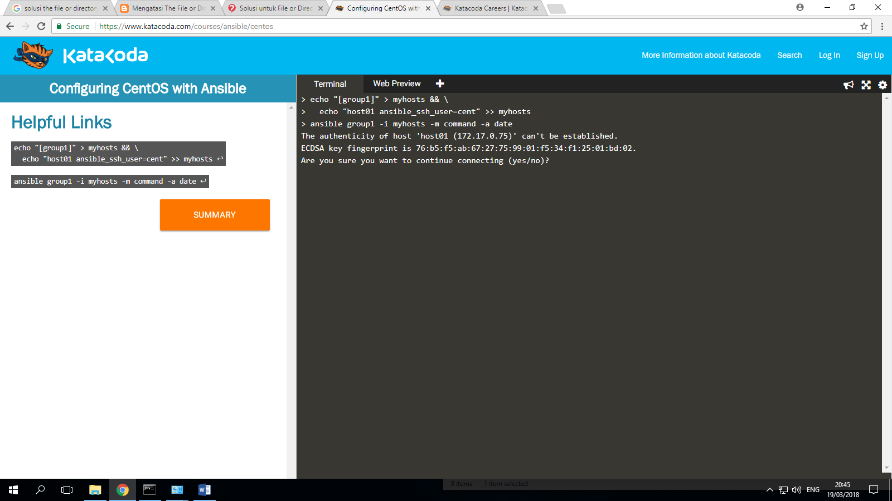
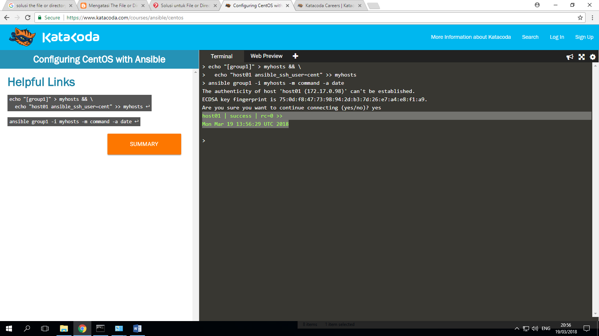

ANSIBLE
-----------

## **Tentang Ansible**
_Ansible_ adalah sebuah provisioning tool yang dikembangkan oleh RedHat. Dimana kamu dapat mencatat setiap proses deployment ataupun konfigurasi yang biasa dilakukan berulang - ulang terhadap beberapa server.

## Langkah Penggunaan (katakoda)
### Ansible - Configuring CentOS with Ansible
``echo "[group1]" > myhosts && \ echo "host01 ansible_ssh_user=cent" >> myhosts
``

``ansible group1 -i myhosts -m command -a date``

### Ansible Configuring CentOS with Ansible part 1

### Ansible Configuring CentOS with Ansible part 2

### Ansible Configuring CentOS with Ansible part 3

